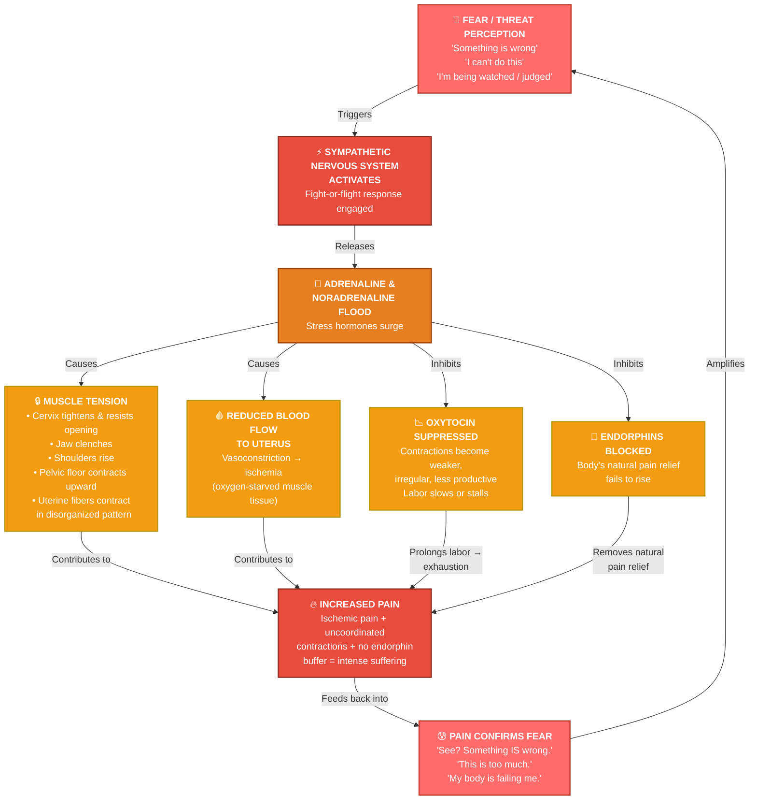
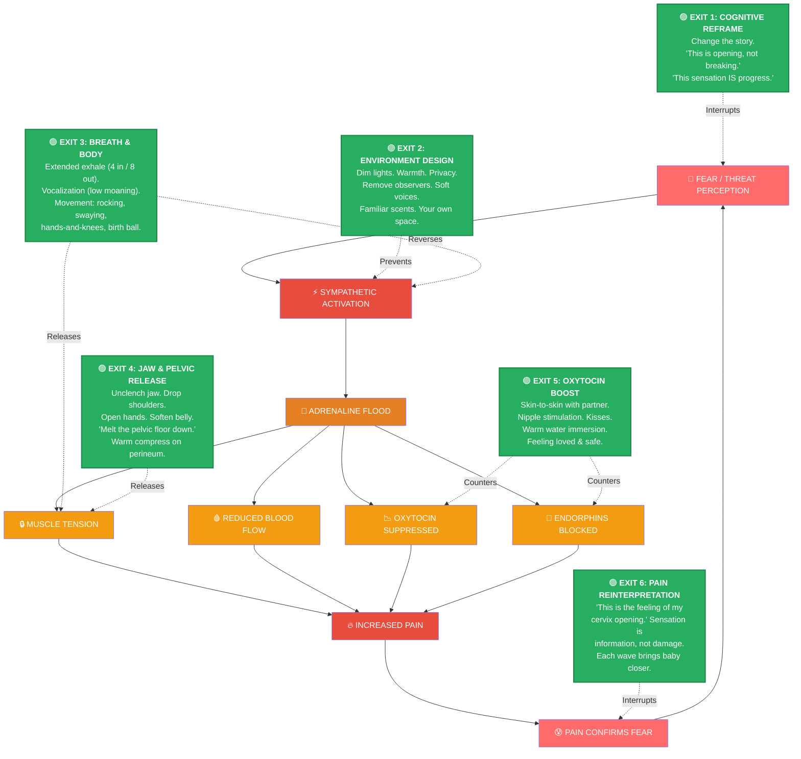

# Welcome, Mama. Pull Up a Chair. ☕

First — twenty-five weeks. You're right in the sweet spot. Your baby is about the size of a cauliflower, kicking like a little martial artist, and you have *time*. That matters. What we build now, in these quiet weeks, is the foundation you'll stand on when the waves come. So let's talk, woman to woman.

---

## Part One: The Sphinx and the Sphincter — Your Body's Ancient Lock and Key

Now, Ina May taught this beautifully, and I've seen it proven with my own eyes over three thousand births, so let me give it to you straight.

**Your cervix is a sphincter.**

That's not a polite word at a dinner party, but it's the truth. A sphincter is a ring of muscle that opens and closes — like your pupils, like the valve at the bottom of your stomach, like the muscles that control your bladder. And here's the thing about *every single sphincter in your body*:

**They do not open on command. They open in safety.**

Think about it. Can you force yourself to urinate when you're terrified? Can you swallow a bite of food when someone is screaming at you? Can your eyes dilate in bright, harsh, threatening light? No. Your body says *not now. Not safe. Close everything down.*

Here's the physiology in plain language:

When you feel **fear, embarrassment, being watched, cold, or urgency**, your brain activates the **sympathetic nervous system** — your fight-or-flight response. Your body floods with **adrenaline and noradrenaline**. And here's what those hormones do:

- They **pull blood away** from your uterus and cervix and send it to your arms and legs (because your body thinks you need to *run*).
- They cause your cervix to **tighten, thicken, and resist opening**. The muscle fibers literally contract inward.
- They **inhibit oxytocin** — the hormone that drives your contractions — and **suppress endorphins**, your body's natural pain relief.
- They can cause your uterus to contract in a **disorganized, uncoordinated pattern** — which is more painful and less effective.

Now flip it.

When you feel **safe, private, warm, unobserved, loved, and unhurried**, your **parasympathetic nervous system** takes over. Your body releases:

- **Oxytocin** — the "love hormone" — which makes your contractions strong, rhythmic, and *productive*. Each one efficiently thins and opens your cervix.
- **Endorphins** — your body's own morphine, up to 200 times more potent than the synthetic version. They rise *with* the intensity of contractions, creating a natural analgesic curve.
- **Prolactin** — which helps you go inward, into that "labor land" where you're half in this world and half in another.

And in this state? **Your cervix softens, thins, and opens.** Not because you forced it. Because you *allowed* it. The sphincter law: **what opens in safety, closes in fear.**

I've watched a cervix go from 4 cm to fully dilated in ninety minutes when a woman finally felt safe. And I've watched a woman sit at 5 cm for *fourteen hours* because she was terrified, cold, and felt judged. Same body. Same baby. Different nervous system.

This isn't woo-woo. This is mammalian biology. You are not a machine. You are an animal — a magnificent, ancient, intelligent animal — and your body knows exactly what it's doing. Your job is not to *make* it happen. Your job is to *get out of the way.*

---

## Part Two: Three Stories from the Birth Room

I'll change names and details, but these are real. I carry every one of them.

---

### Story One: "The Watched Woman" — Fear That Stalled Everything

**Maria**, 31, first baby. She'd read all the books. She had a birth plan laminated in a folder. She wanted a natural birth, and she *meant* it.

She came in at 4 cm, contracting every four minutes, doing beautifully. Her partner was there. Her mother was there. Her mother's sister was there. A doula. Two nurses checking in every twenty minutes. The room was bright. Someone kept asking her, "How are you doing? Are you okay? Do you need anything?"

By hour six, she was still 4 cm.

Her contractions had become irregular. She was tensing her shoulders up to her ears with every wave. She kept looking at the monitor. She kept asking, "Is this normal? Am I doing it right?"

I came in, looked at the room, and I saw the problem immediately. **She was performing labor for an audience.**

I asked everyone to leave except her partner. I dimmed the lights. I brought her a warm blanket. I said, "Maria, you don't owe anyone a performance. You don't have to do this 'correctly.' You can moan, you can swear, you can get on all fours and look undignified. Nobody is grading you."

She cried. And then, within two hours, she was at 7 cm.

But here's the thing — the damage from those first six hours of tension had made her exhausted. She ended up with a prolonged second stage and a vacuum-assisted birth. The baby was fine. She was fine. But she told me afterward, "I feel like I failed."

I told her, "You didn't fail. You were never given the chance to be an animal. You were asked to be a patient." And she wept again, but this time it was a different kind of crying.

**The lesson:** Fear doesn't always look like screaming. Sometimes it looks like *trying to be good.* Trying to do it right. Needing approval. That's fear in a polite dress, and it clamps a cervix shut just as surely as panic does.

---

### Story Two: "The Turn" — A Mindset Shift That Changed Everything

**Keisha**, 28, second baby. Her first birth had been a traumatic emergency cesarean — cord prolapse, alarms, running down the hallway, general anesthesia. She woke up with a baby she hadn't gotten to meet for two hours.

She came to me at 38 weeks for her second birth, and she was *terrified*. Not of the pain. Of the *loss of control*. Of the alarms. Of the ceiling tiles. She told me, "I keep seeing that hallway. I keep hearing those wheels."

She went into labor at 39+4. Early on, she was doing well — breathing, moving, vocalizing. But around 6 cm, she hit a wall. Her body remembered. She started shaking. She said, "It's happening again. Something's wrong. I can feel it."

Her contractions became erratic. She was at 6 cm for three hours.

I sat beside her. I didn't touch her yet. I just said, "Keisha. Look at me. You are not in that hallway. You are in a warm room. Your baby's heart rate is strong and steady. I can hear it right now — *boom, boom, boom* — like a little drum. Your body is not betraying you. Your body is *remembering*, and that's not the same thing. You are safe. I am here. And this time, you get to meet your baby the moment she's born."

I asked her to put her hand on her belly and feel the baby move. She did. The baby kicked. Keisha laughed — a wet, teary laugh — and said, "Okay, little girl. Let's do this."

Something shifted. I could *see* it in her face. Her shoulders dropped. Her jaw unclenched. She got on her hands and knees and started rocking.

She went from 6 cm to fully dilated in **forty-seven minutes**. She pushed for twelve minutes. She caught her own baby. She held her daughter against her chest and said, "I got you this time."

**The lesson:** The body keeps the score. But the mind can rewrite the story. Keisha didn't need to *forget* her first birth. She needed to *separate* it from this one. She needed someone to say, "That was then. This is now." And she needed to *choose* to believe it. The shift wasn't magical. It was a decision. And her cervix responded to that decision like a flower responding to sunlight.

---

### Story Three: "The Quiet Room" — A Birth So Fast We Almost Missed It

**Lena**, 34, fourth baby. She'd had three hospital births — all fine, all "normal," but all with that fluorescent-light, beeping-monitor, "okay ma'am time to push now" energy.

For her fourth, she came to a birth center. She walked in at 2 a.m. saying, "I think I'm having contractions, but I'm not sure." She was laughing. She'd been at home, in her own bed, in the dark, with her husband asleep beside her, and the contractions had been building for hours without her fully registering them.

She was **8 cm** when she walked through the door.

The room was dim. Warm. There was a candle. A birth ball. A bathtub. No monitors beeping. No one asking her to sign forms. I said, "Take your time. Get comfortable. There's no rush."

She got in the tub. She leaned forward over the edge. Her husband sat behind her, hand on her back. She made low, guttural sounds — not screams, more like a cello.

She was fully dilated within ten minutes. She pushed for **eight minutes**. The baby was born at 3:47 a.m. — less than two hours after she'd walked in.

Afterward, she said something I'll never forget. She said, "I didn't even know I was in labor for most of it. I think that's the point. My body was doing it while I wasn't *managing* it."

**The lesson:** Lena's body had been laboring for hours in the safest environment possible — her own home, in the dark, half-asleep, unobserved. No one was timing her. No one was measuring her. Her sphincters were wide open because her nervous system was in full parasympathetic rest. By the time she "noticed" the labor, her body had already done most of the work. That's what happens when you remove every single threat signal from the environment. The body doesn't need your *permission*. It needs your *absence of interference*.

---

## Part Three: The Single Most Important Thing You Can Do Right Now at 25 Weeks

I'm going to be very specific, because you asked for *one* thing.

**Practice the "exhale longer than the inhale" breath, every single day, for ten minutes.**

Here's why this is the one:

When you extend your exhale — say, inhale for 4 counts, exhale for 7 or 8 — you are **manually activating your parasympathetic nervous system**. You are literally pressing the "safe" button in your brainstem. You cannot do this and be in fight-or-flight at the same time. It is physiologically impossible.

But here's the deeper reason I choose this over affirmations, over visualization, over birth classes (all of which are good):

**In labor, when the wave hits, you will forget everything.** You will forget the affirmations. You will forget the birth plan. You will forget the names of the hormones. But if you have drilled this breath into your body for *months* — if it lives in your muscles, in your bones, in your autonomic memory — your body will find it *automatically*, even when your conscious mind goes offline.

This is how you build the neural pathway between "contraction begins" and "body opens" instead of "contraction begins" and "body clenches."

**How to do it:**

- Sit or lie comfortably. Hand on your belly.
- Inhale through your nose for 4 counts. Feel your belly rise.
- Exhale through your mouth for 7–8 counts. Make a soft "ahhh" or "ooooh" sound. Feel your belly fall. Feel your jaw go slack. Feel your pelvic floor *release downward* — like a sigh, but in your whole body.
- Do this for 10 minutes. Every day. Same time if you can. Morning or before bed.
- As you exhale, silently say: *"I open. I release. I trust."*

By the time you're 40 weeks, this breath will be as automatic as blinking. And when that first real contraction hits at 2 a.m., your body will do it before your mind even wakes up.

---

## Part Four: "Trusting the Process" — The Inner Monologue During a Contraction

People say "trust the process" and it sounds like a bumper sticker. Let me walk you through what it *actually* sounds like inside your head when a contraction is building at 7 cm and it feels like your body is being split open.

**The contraction begins.** You feel the tightening start low, like a fist slowly closing around your uterus.

❌ **The fear voice says:** *"Oh God, here it comes. This is going to be unbearable. I can't do this. Make it stop. Something is wrong. This is too much."*

This voice tightens your jaw, raises your shoulders, makes you hold your breath. Your cervix feels it. It says, *Not safe. Close.*

✅ **The trust voice says:**

*"Here's the wave. I feel it building. Okay. I'm going to breathe into it. Not against it. Into it.*

*This is not pain. This is* ***pressure. This is opening.*** *This is my body doing the thing it was designed to do. Women have done this for three hundred thousand years. My body knows the way. I don't have to figure it out. I just have to* ***not resist.***

*Inhale... one, two, three, four.*

*Exhale... one, two, three, four, five, six, seven... let it go. Let it all go. My jaw is soft. My shoulders are down. My belly is soft. I am opening.*

*This wave has a peak. And then it will end. It always ends. Every single one has ended so far, and this one will too.*

*I am not fighting this. I am* ***riding*** *it. Like a wave in the ocean. You don't fight the ocean. You float. You breathe. You let it carry you.*

*My baby is moving down. I can feel it. We are working together. My baby knows what to do. I just have to stay out of the way.*

*This is the hardest thing I'll ever do, and I am doing it. I am not broken. I am not failing. This is what it's supposed to feel like. This intensity* ***is*** *the process. It's not a sign that something is wrong. It's a sign that something is* ***right.***

*The wave is passing. It's easing. I can feel it letting go.*

*Rest now. Breathe. The next one will come, and I will ride that one too. And the one after that. And the one after that. And then I will hold my baby."*

**That's** what trusting the process looks like. It's not bliss. It's not zen. It's a *choice*, made in the middle of fire, to interpret the sensation as **progress** instead of **threat**. And that single reframe — *this is opening, not breaking* — changes your entire hormonal cascade.

You will not do this perfectly. You will lose the thread. The fear voice will creep back in. That's okay. You just come back to the breath. You just come back to the one sentence: * **"I open. I release. I trust."** * And you start again.

---

## Part Five: Three Questions to Ask Yourself This Week

Find a quiet evening. Make tea. Light a candle if you like. Get a journal — a real one, with a pen. And sit with these three questions. Don't rush. Don't perform. Write whatever comes, even if it's ugly, even if it's "silly," even if it surprises you.

---

**Question 1:**

*"When I imagine my birth, what is the specific image or moment that makes my stomach drop?"*

Not the general fear. The *specific* one. Is it the moment the pain becomes "too much"? Is it the idea of losing control — of screaming, of being naked, of being seen? Is it a memory of someone else's birth story that went wrong? Is it the image of a medical intervention you're afraid of? Name it. Write it down. Say it out loud to an empty room if you need to. **A fear you can name is a fear you can work with. A fear you can't name runs the show from the shadows.**

---

**Question 2:**

*"Whose voice is in my head when I think about birth — and is it mine?"*

Is it your mother's voice, telling you it was agony? Is it a friend's horror story? Is it a movie scene? Is it a cultural narrative that says birth is a medical emergency, that your body is unreliable, that you will need to be saved? **Where did your story about birth come from?** And here's the follow-up: *Is that story true for* ***me?*** You are allowed to set down someone else's story and write your own.

---

**Question 3:**

*"If I knew — truly knew, in my bones — that my body could do this, what would I do differently between now and the day my baby is born?"*

This one is about *agency*. This one is about the gap between what you believe and how you're preparing. Maybe the answer is: I'd stop reading horror stories online. Maybe it's: I'd hire a doula. Maybe it's: I'd talk to my partner about what I actually need in the room. Maybe it's: I'd stop apologizing for wanting what I want. **Write the answer down. And then do that thing. This week. Not next month. This week.**

---

## A Final Word, Mama

You are twenty-five weeks along. You are already doing the most important thing: **you are preparing your mind, not just your body.** Most women spend nine months preparing a nursery and thirty minutes preparing their nervous system. You are doing it differently, and that matters.

Your body has been growing a human being for twenty-five weeks. It has been building a placenta, amniotic fluid, a cervix that will stretch to ten centimeters, a pelvis that will shift and open, hormones that will flood your system at exactly the right moment. **Your body has been preparing for this birth since the day you conceived.** You don't need to earn it. You don't need to be brave enough, strong enough, or "good enough." You just need to trust the animal wisdom that lives in you — the same wisdom that has brought every single human being who has ever lived into this world.

You are not a patient. You are not a procedure. You are a woman, and you are about to do the most ancient, powerful, ordinary, extraordinary thing a human body can do.

And you are going to be *magnificent.*

Now go make that tea. Light that candle. And breathe.

Inhale... four.

Exhale... seven.

*I open. I release. I trust.*

You've got this, mama. And I'll be right here. 💛

---

*This is educational information for birth preparation, not medical advice. Always work with your qualified prenatal care provider for your individual health needs.*

---

# The Fear-Tension-Pain Cycle: A Map of the Trap (and Every Exit Door)

Alright, mama. You asked for the mechanics, so let's get under the hood. This cycle was first described by **Grantly Dick-Read** in the 1930s — an obstetrician who noticed that women in certain cultures birthed with remarkably little suffering, and he realized the difference wasn't anatomy. It was *fear*. He called it the **Fear-Tension-Pain syndrome**. Ina May carried it forward. And I've watched it play out, birth after birth, for thirty years.

Let me draw you the whole vicious loop, and then I'll show you exactly where you can **cut the wire.**

---

## The Cycle — Mermaid Flowchart

---

## Now Let Me Walk You Through Every Single Node

### Node A — Fear / Threat Perception

This is where it all starts. And here's what's critical: **your brain does not distinguish between a real threat and an imagined one.** A lion chasing you and the thought *"what if I need an emergency C-section?"* activate the **exact same neural pathway** — the amygdala fires, the hypothalamus signals the adrenal glands, and the cascade begins.

Common triggers in labor:
- Feeling observed or judged
- Bright lights, cold rooms, unfamiliar sounds
- Time pressure ("you need to dilate faster")
- A care provider's anxious tone
- A memory of a previous traumatic birth
- The inner narrative: *"This shouldn't hurt this much"*

### Node B — Sympathetic Nervous System Activation

Your autonomic nervous system has two modes:

| **Sympathetic (Fight/Flight)** | **Parasympathetic (Rest/Digest)** |
|---|---|
| "Danger! Mobilize!" | "Safe. Restore." |
| Heart rate up, blood to limbs | Heart rate steady, blood to organs |
| Sphincters CLOSE | Sphincters OPEN |
| Oxytocin suppressed | Oxytocin flows freely |
| Endorphins suppressed | Endorphins rise with contractions |
| Cervix tightens | Cervix softens and dilates |

**You cannot be in both modes simultaneously.** This is the single most important fact in this entire diagram.

### Node C — Adrenaline & Noradrenaline Flood

These are **catecholamines**. In small amounts, they're useful — a little adrenaline at the very end of labor gives you the "second wind" to push. But in *sustained* high levels during active labor, they are **directly antagonistic to oxytocin**. They literally block its receptors. They tell your uterus: *"Stop. This is not the time."*

### Node D — Muscle Tension

This is the most *visible* part of the cycle, and it's where most women notice something is wrong. Watch a laboring woman in fear:

- **Jaw clenched** (the jaw and the cervix are neurologically linked — a tight jaw signals a tight cervix)
- **Shoulders up to the ears**
- **Hands in fists**
- **Breath held or shallow and rapid**
- **Pelvic floor pulling UP** instead of releasing down
- **Thighs squeezing together**

Every one of these is your body *bracing against* the contraction instead of *opening to* it. And the cervix — that beautiful, patient sphincter — reads all of this and says: *"Not safe. I'm staying closed."*

### Node E — Reduced Blood Flow (Ischemia)

Adrenaline causes **vasoconstriction** — your blood vessels narrow. Blood is diverted from your uterus to your skeletal muscles (arms, legs — for running). The uterine muscle, now contracting without adequate oxygen, produces **lactic acid** — the same burning you feel in a muscle you've overworked. This is a significant source of labor pain that *would not exist* without the fear response.

### Node F — Oxytocin Suppressed

Oxytocin is the **master hormone of birth**. It:
- Drives rhythmic, coordinated contractions
- Causes the cervix to efface and dilate
- Triggers the Ferguson reflex (the urge to push)
- Promotes bonding and the "rush" of love at birth
- Stimulates endorphin release

Adrenaline **directly inhibits oxytocin release** from the posterior pituitary. Less oxytocin → weaker contractions → longer labor → more exhaustion → more fear. The cycle feeds itself.

### Node G — Endorphins Blocked

Endorphins are your body's **endogenous opioids**. In an undisturbed labor, they rise *in proportion* to contraction intensity. By transition (8–10 cm), a woman in a calm state has endorphin levels **higher than a morphine drip**. She enters "labor land" — a trance-like, inward, almost psychedelic state. She is *high on her own chemistry.*

Adrenaline blocks this. So the woman in fear gets **all the pain with none of the natural analgesia.** She is, essentially, laboring "raw."

### Node H — Increased Pain

Now you have the perfect storm:
- Ischemic, oxygen-starved uterine muscle (burning)
- Uncoordinated, inefficient contractions (more work, less progress)
- No endorphin buffer (full pain perception)
- A cervix that is physically resisting (pressure against a closed door)
- Exhaustion from prolonged labor

The pain is **real**. I want to be clear about that. This is not "all in her head." The fear has created *actual physiological conditions* that generate *actual pain.* The suffering is genuine.

### Node I — Pain Confirms Fear

And here's the cruelest part of the cycle: **the pain validates the original fear.** The woman thinks, *"See? I knew something was wrong. This is too much. My body can't do this."* And that thought sends her right back to Node A. The loop tightens. The cervix clamps further. The pain increases. The fear deepens.

**This is why unmedicated labor in a fearful state can be genuinely more painful than a well-supported, calm labor — even at the same dilation.** It's not imagination. It's biochemistry.

---

## The Intervention Map — Where You Can Cut the Wire

Now here's the beautiful part. **This cycle has at least six points where you can interrupt it.** You don't need to break all of them. You only need to break **one** to collapse the entire loop.

---

## The Six Exits — In Detail

### 🟢 EXIT 1: Cognitive Reframe (Interrupts Node A — Fear Itself)

**When:** Before labor and during early labor.

**How:** You change the *meaning* you assign to the sensation. This is not positive thinking. This is **accurate thinking.**

| Fear thought | Reframe |
|---|---|
| "This pain means something is wrong" | "This sensation means my cervix is opening" |
| "I can't handle this" | "I have handled every contraction so far. This one will also end." |
| "My body is failing" | "My body is doing the most sophisticated thing it has ever done" |
| "This will never end" | "Every wave has a peak and a trough. I am in the trough now. The next peak will come, and it will pass." |

**Why it works:** The amygdala responds to *interpretation*, not just stimulus. If you label the sensation as "progress" instead of "threat," the amygdala does not fire the alarm. No alarm → no adrenaline → no cycle.

**Practice now at 25 weeks:** When you feel a Braxton Hicks contraction, practice saying out loud: *"There's a practice wave. My uterus is rehearsing. Thank you, body."* You are building the neural pathway *now* so it's automatic *then.*

---

### 🟢 EXIT 2: Environment Design (Prevents Node B — Sympathetic Activation)

**When:** Before labor begins and throughout.

**How:** You **architect your birth space** to eliminate every threat signal your mammalian brain can detect.

- **Dim the lights.** Bright light = exposure = threat. Candlelight or a single warm lamp.
- **Warmth.** Cold = danger to a mammal. Warm blankets. Warm room. Warm water.
- **Privacy.** Remove observers. Fewer people = safer. If someone in the room makes you feel "watched," they need to leave. Period. No politeness required.
- **Familiar sounds.** Your own music. Your partner's voice. Not beeping machines.
- **Familiar scents.** Bring a pillow from home. A candle you love. Your mammalian brain recognizes "home" through smell.
- **No time pressure.** Remove clocks from the room. Ask your care team not to announce dilation numbers unless you want to hear them.

**Why it works:** You are speaking directly to the **limbic system** — the ancient, pre-verbal part of your brain that decides "safe" or "not safe" before your conscious mind even processes the environment. You cannot *think* your way into safety. You have to *build* it around you.

---

### 🟢 EXIT 3: Breath & Body (Reverses Node B and Releases Node D)

**When:** During every contraction.

**How:**

- **Extended exhale.** Inhale 4 counts through the nose. Exhale 7–8 counts through the mouth. This **directly stimulates the vagus nerve**, which activates the parasympathetic system. You are manually flipping the switch from "fight" to "rest."
- **Vocalization.** Low, open-throated sounds — "ooooh," "aaaah," a moan, a hum. **Not** high-pitched screaming (that tightens the throat and signals panic). Think of the sound a cow makes. Think of a cello. The vibration in your chest and throat **releases the jaw**, and a released jaw signals a released cervix.
- **Movement.** Swaying. Rocking. Hands and knees. Leaning forward over a birth ball or your partner. Walking. **Movement prevents the "freeze" response** and helps baby navigate the pelvis. A still, supine woman is a woman whose body has gone into "play dead."

**Why it works:** You cannot be in sympathetic activation and parasympathetic activation at the same time. The extended exhale *forces* the switch. And movement tells your brain: *"I am not frozen. I am not trapped. I am an animal in motion. I am safe."*

---

### 🟢 EXIT 4: Jaw & Pelvic Floor Release (Releases Node D — Tension)

**When:** During contractions, especially in active labor and transition.

**How:**

- **Unclench your jaw.** Let your mouth hang open. Let your lower jaw go slack and heavy. Wiggle it side to side. Make a silly, loose-lipped "brrrr" sound.
- **Drop your shoulders.** Consciously pull them down away from your ears. Shake them out between contractions.
- **Open your hands.** Unclench your fists. Spread your fingers wide. Soft palms. (Hands and jaw are neurologically linked — open hands = open jaw = open cervix.)
- **Soften your belly.** Place your hands on your lower abdomen and *let it be soft*, even during a contraction. Don't brace. Don't tighten. Let the uterus do its work without your abdominal muscles fighting it.
- **Release the pelvic floor downward.** Imagine your sitz bones spreading apart. Imagine your perineum melting, softening, opening like a flower. On each exhale, visualize the pelvic floor *dropping* — not pushing, just *releasing.*
- **Warm compress** on the perineum during the second stage.

**Why it works:** The **jaw-cervix connection** is well-documented. The trigeminal nerve (jaw) and the pelvic nerves share pathways in the spinal cord. A clenched jaw sends a reflex signal to the pelvic floor: *"Tighten."* A slack jaw sends the opposite signal: *"Release."* This is why Ina May always said, *"Loosen your jaw, and your cervix will follow."*

---

### 🟢 EXIT 5: Oxytocin Boost (Counters Nodes F & G)

**When:** Throughout labor, especially if labor slows.

**How:**

- **Skin-to-skin contact with your partner.** Chest to chest. His hands on your back. Your face against his neck. This releases oxytocin in *both* of you.
- **Kisses. Touch. Eye contact.** Oxytocin is the hormone of love and connection. It flows in the presence of a trusted, beloved person.
- **Warm water immersion.** A birth tub or even a warm shower. The warmth and buoyancy reduce adrenaline and promote oxytocin release. Many women call the tub "the midwife's epidural."
- **Nipple stimulation.** Gentle rolling or suckling releases oxytocin directly from the posterior pituitary. This is the same mechanism a baby uses to trigger contractions.
- **Feeling emotionally safe and loved.** This is not a "technique." This is a *condition.* If you do not feel safe with the people in the room, oxytocin will not flow. You have the right to ask anyone to leave. You have the right to say, "I need just my partner." You have the right to dim the lights and close the door.

**Why it works:** Oxytocin and adrenaline are **biochemical antagonists**. They cannot coexist in high concentrations. When oxytocin rises, adrenaline falls. When adrenaline falls, the cervix opens, contractions coordinate, and endorphins begin to flow. You are literally *replacing* the fear chemistry with the love chemistry.

---

### 🟢 EXIT 6: Pain Reinterpretation (Interrupts Node I — the Feedback Loop)

**When:** In the moment of intense sensation, especially at transition (8–10 cm).

**How:** This is the most advanced skill, and it builds on Exit 1. But in the heat of the moment, it looks like this:

You feel the wave crest. It is *enormous.* Every nerve in your body is firing. And the thought comes: *"This is too much. I can't. Something is wrong."*

And you **catch the thought.** You don't fight it. You don't judge yourself for having it. You simply say, internally:

*"That's the fear talking. That's not the truth. The truth is: this sensation is my cervix opening from eight to nine centimeters. This is the most productive moment of my labor. This intensity means my baby is almost here. This is not damage. This is* ***arrival.***"

And then you breathe. Long exhale. Soft jaw. Open hands.

*"I open. I release. I trust."*

**Why it works:** You are **breaking the feedback loop at its most critical point.** Node I is where pain *becomes* fear again. If you can intercept that translation — if you can feel the sensation *without* labeling it as "wrong" — the cycle cannot restart. The pain is still there. But it is no longer *suffering.* It is *sensation with meaning.* And sensation with meaning is bearable. Suffering without meaning is not.

---

## The Summary — Your Cheat Sheet

| **Exit** | **Where it breaks the cycle** | **What it does** | **When to use it** |
|---|---|---|---|
| 1. Cognitive Reframe | Node A (Fear) | Changes the meaning of sensation | Before & during labor |
| 2. Environment Design | Node B (Sympathetic activation) | Prevents the alarm from firing | Before labor begins |
| 3. Breath & Movement | Nodes B & D | Forces parasympathetic switch; releases tension | Every contraction |
| 4. Jaw & Pelvic Release | Node D (Tension) | Unlocks the physical "clench" | Active labor & transition |
| 5. Oxytocin Boost | Nodes F & G | Replaces adrenaline with love chemistry | Throughout; especially if labor slows |
| 6. Pain Reinterpretation | Node I (Feedback loop) | Stops pain from becoming fear again | Peak intensity / transition |

---

## One Last Thing, Mama

Here's what I want you to take away from this diagram:

**The cycle is not your fault.** It is a *mammalian design feature* that was meant to protect you from predators. It is not a flaw. It is not a weakness. Your body is doing exactly what it evolved to do when it perceives a threat. The problem is that *modern birth environments* — bright lights, strangers, monitors, time pressure, medical language — are full of threat signals that our ancient brains interpret as *"predator nearby."*

And here's the other thing: **you only need to break the cycle in ONE place to collapse the whole loop.** You don't need to be perfect. You don't need to do all six exits simultaneously. If you can just *breathe* — just extend that exhale, just soften that jaw — you have interrupted the cascade. The adrenaline drops. The oxytocin rises. The cervix softens. The pain shifts from "suffering" to "sensation." And the cycle *unwinds.*

You don't have to be fearless. You just have to be **willing to soften.**

And you, mama, at twenty-five weeks, with your hand on your belly and your breath already practicing — you are already softer than you know.

Now go practice that exhale. Four in. Eight out. Soft jaw. Open hands.

*I open. I release. I trust.*

You've got this. 💛

---

*This is educational information for birth preparation, not medical advice. Always work with your qualified prenatal care provider for your individual health needs.*

---

# The Five Fears That Visit Almost Every First-Time Mother (And What the Science Actually Says)

Alright, mama. Sit down. Pour yourself something warm. This is the conversation I wish someone had sat down and had with *me* before my first birth, thirty-two years ago. Because here's the thing about fears: **they grow in the dark.** They whisper at 2 a.m. when you're lying awake with your hand on your belly, and they sound *so* convincing in the dark. But when you turn on the light — when you look at them squarely, with evidence, with data, with the calm voice of someone who has watched three thousand women walk through this exact fire — they shrink. Not always to nothing. But to *manageable.* And manageable is all you need.

Let me walk you through the five fears that show up in study after study, across cultures, across decades. And for each one, I'm going to give you two things: **what the fear whispers** and **what the evidence actually says.** Because you deserve the truth, not platitudes.

---

## Fear #1: "The Pain Will Be Unbearable"

### What the fear whispers:

*"I've heard the stories. Level 10 pain. Like breaking twenty bones at once. I'll scream. I'll beg for drugs. I'll lose my mind. I won't be able to cope. I'm not strong enough."*

This is the **number one fear** across virtually every study ever conducted on childbirth anxiety. It's the one that keeps women up at night. It's the one their mothers, their friends, their movies, their culture have drilled into them since girlhood.

### What the evidence says:

**The fear itself makes the pain worse.** This is not a metaphor. This is measured, quantified physiology.

- **Wuitchik et al. (1989)** — a landmark study published in *Pain* — found that women who reported **higher anxiety and fear before labor** experienced **significantly more pain** during labor, even when controlling for other variables. Their pain scores were higher. Their requests for analgesia came earlier. Their labors were longer.
- **Adams et al. (2012)**, published in *BJOG*, followed over 2,000 nulliparous women and found that **fear of pain was the strongest predictor of requesting an epidural**, even more than actual pain intensity. In other words, it wasn't the pain that drove the request — it was the *anticipation* and *interpretation* of the pain.
- **The gate control theory of pain (Melzack & Wall, 1965)** explains why: pain signals travel from the uterus through the spinal cord to the brain, but they pass through a "gate" that can be **opened wider or narrowed** by psychological factors. Fear, anxiety, and tension **open the gate wider**, amplifying the signal. Calm, distraction, and a sense of safety **narrow the gate**, reducing perceived intensity.
- **Endorphin research**: In an undisturbed, supported labor, endorphin levels rise progressively with contraction intensity. By transition (8–10 cm), a calm woman's endorphin levels can reach **200 times the potency of morphine** (as measured in beta-endorphin assays). She enters an altered state — "labor land" — where she is partially dissociated, inward-focused, and experiencing a natural analgesic effect. **This system does not activate in a fearful, adrenaline-flooded state.**
- **Cross-cultural evidence**: Anthropological studies (Briggs, 1970; Jordan, 1993) have documented cultures where birth is experienced with minimal distress — not because those women have different anatomy, but because the *cultural narrative* around birth is one of normalcy, power, and community rather than danger and suffering. The pain is present, but the *suffering* — the layer of "this is wrong, this is too much, I can't" — is absent.

### The reframe:

The pain of labor is **real**. I will never gaslight you into thinking it isn't. But it is not the pain of *damage*. It is the pain of *opening*. It is the pain of a muscle doing the most extraordinary work it will ever do. And your body has a built-in pain management system — endorphins, oxytocin, the trance state of labor land — that is **more sophisticated than any drug we can offer.** But it only works if you let it. And you can only let it if you stop being afraid of the sensation.

**The pain is not your enemy. It is the sound of your cervix opening. It is your baby's knock on the door.**

---

## Fear #2: "I'll Lose Control — of My Body, My Dignity, Myself"

### What the fear whispers:

*"I'll scream in front of strangers. I'll vomit. I'll defecate. I'll be naked and exposed. I'll beg. I'll say things I regret. I'll become an animal. I won't recognize myself. I'll be humiliated."*

This fear is **enormous** among first-time mothers, and it's rarely spoken aloud because it's tangled up with shame. We live in a culture that tells women to be composed, polite, in control. And birth asks you to be *none of those things.*

### What the evidence says:

- **Melender (2002)**, a Finnish qualitative study of 32 nulliparous women, found that **fear of losing control and dignity** was the second most commonly reported fear, after pain. Women described fears of "being exposed," "being seen in an undignified state," and "not being able to behave properly."
- **O'Connell et al. (2008)**, in *Midwifery*, surveyed nulliparous women and found that **fear of losing control was significantly associated with:**
    - Higher rates of epidural request (even when pain was manageable)
    - Higher rates of elective cesarean section
    - Lower birth satisfaction scores
    - Higher rates of postpartum PTSD symptoms
- **The "observer effect" in labor**: Research by **Hodnett et al. (2013)** (Cochrane Review on continuous support during labor) demonstrated that the **presence of unfamiliar observers** (students, multiple staff changes, non-continuous care) was associated with:
    - Longer labors
    - Higher intervention rates
    - Lower satisfaction
    - More negative birth experiences
- In contrast, **continuous one-on-one support** (a doula, a known midwife) was associated with a **25% reduction in cesarean rate**, a **39% reduction in the use of synthetic oxytocin**, and a **31% reduction in the use of any pain medication.** The woman who feels *unobserved and supported* labors differently than the woman who feels *watched and managed.*
- **The "performance" paradigm**: Sociologist **Robbie Davis-Floyd (1992)**, in her landmark book *Birth as an American Rite of Passage*, documented how the hospital birth environment — with its gowns, stirrups, monitors, and "patient" language — creates a **power dynamic** in which the woman feels she is performing for an audience of experts. This performance anxiety activates the sympathetic nervous system and inhibits labor progress. Women who birth in environments where they feel like **the protagonist** rather than **the patient** report dramatically different experiences.
- **On the "undignified" things**: Let me be practical. Yes, you might vomit. Yes, you might have a bowel movement while pushing. Yes, you will be naked. Here's what I've seen in 3,000 births: **the woman herself almost never cares.** She is in labor land. She is in another dimension. The people who are embarrassed are the *observers*, not the woman. And a good birth team treats a bowel movement the way you'd treat a sneeze — with complete nonchalance. I have wiped, cleaned, and moved on so many times that it is as unremarkable to me as breathing. **Your dignity is not in your composure. Your dignity is in your power.**

### The reframe:

You are not going to "lose control." You are going to **surrender control** — and those are very different things. Losing control is what happens when you're in a car accident. Surrendering control is what happens when you float on your back in the ocean and let the water hold you. You are still conscious. You are still *you.* But you have stopped trying to *manage* the waves, and you have started *riding* them.

And the "undignified" things? They are the most *dignified* things a human body can do. A woman in the full roar of labor, naked, sweating, vocalizing from her gut, is not undignified. She is **sacred.** She is doing what every woman who has ever lived has done. She is a goddess in the oldest sense of the word. And anyone in that room who cannot see that **does not deserve to be in that room.**

---

## Fear #3: "Something Will Go Wrong and I'll Need an Emergency Cesarean"

### What the fear whispers:

*"What if the cord wraps around the neck? What if the baby gets stuck? What if my pelvis is too small? What if the heart rate drops? What if they rush me to surgery? What if I wake up and it's over and I missed it? What if I 'fail' and end up with a scar?"*

This fear is particularly prevalent in countries with **high cesarean rates** and in women who have been exposed to **dramatic birth narratives** (TV shows, social media, horror stories from friends).

### What the evidence says:

- **Prevalence**: Studies consistently show that **fear of emergency intervention** is among the top three fears for nulliparous women. **Alehagen et al. (2001)**, a Swedish study of 1,227 women, found that approximately **20% of nulliparous women** reported significant fear of emergency cesarean or instrumental delivery.
- **The self-fulfilling prophecy**: This is the most critical finding. **Adams et al. (2012)** and **Laursen et al. (2008)** both demonstrated that **women who reported high fear of childbirth in the third trimester had significantly higher rates of emergency cesarean section**, even after controlling for medical risk factors.
- Why? Because of the fear-tension-pain cycle we discussed. Fear → adrenaline → uncoordinated contractions → stalled labor → "failure to progress" → cesarean. **The fear itself creates the very outcome it fears.** This is not a small effect. Laursen et al. found that women with severe fear of childbirth (WDEQ score ≥85) had a **cesarean rate approximately 2–3 times higher** than women with low fear scores.
- **The "too small pelvis" myth**: Let me address this directly, because it is one of the most persistent and damaging fears. **The female pelvis is not a fixed, rigid structure.** During pregnancy, the hormone **relaxin** softens the ligaments of the pelvic joints. During labor, the sacrum (the triangular bone at the base of your spine) **tilts backward**, increasing the pelvic outlet by up to **1.5–2 cm**. The pubic symphysis **widens**. The pelvic floor muscles **stretch and thin**. Your pelvis is *designed* to open. The idea that your pelvis is "too small" is, in the vast majority of cases, **not true.** True cephalopelvic disproportion (where the baby's head genuinely cannot fit through the pelvis) is **rare** — estimated at **less than 1–2% of births** in well-nourished populations.
- What is *not* rare is a pelvis that *appears* too small because the woman is **tense, upright, supine, and fearful** — all of which prevent the pelvis from reaching its maximum diameter. A woman on her back with her legs in stirrups has a **smaller pelvic outlet** than a woman on her hands and knees, squatting, or side-lying. **Position matters. Relaxation matters. Gravity matters.**
- **Cord around the neck**: This fear is *everywhere*, and the evidence is reassuring. **Nuchal cords** (cord around the neck) occur in approximately **20–30% of all births.** The vast majority are **loose, single loops** that do not affect the baby. The cord is protected by **Wharton's jelly**, a thick, gelatinous substance that prevents compression. True cord emergencies (tight, multiple loops causing significant heart rate deceleration) are **rare** — occurring in approximately **1–2% of births** — and are detectable by fetal monitoring. The cord is not a noose. It is a lifeline, and it is remarkably resilient.
- **The "failure" narrative**: I need to say this clearly: **a cesarean is not a failure.** If you need one, it is a *tool* that keeps you and your baby safe. But the *fear* of needing one — the dread, the sense that it would mean you "couldn't do it" — is what poisons the labor. And the evidence shows that this fear, by activating the stress response, actually *increases* the likelihood of the very intervention you dread. **The best way to reduce your cesarean risk is to reduce your fear.** It's that direct.

### The reframe:

Your body is not a ticking time bomb. It is not a machine that will "malfunction." It is a **living, adaptive, intelligent system** that has been refined by 300,000 years of human evolution. The odds are overwhelmingly in your favor. And even in the rare event that something genuinely unexpected happens, you are in a medical system that can respond. **You are not alone. You are not without a safety net. And a cesarean, if it happens, is not a verdict on your womanhood. It is a bridge to your baby.**

But here's the key: **you don't need to solve the "what if" before labor.** You don't need to pre-grieve a cesarean that will probably never happen. You need to trust that *future you* — the you in the birth room, with your team, with your baby's heartbeat strong on the monitor — will handle whatever comes. And she will. She always does.

---

## Fear #4: "My Baby Will Be Hurt — or I'll Hurt My Baby"

### What the fear whispers:

*"What if the baby is缺氧 (oxygen-deprived)? What if I push too hard? What if I don't push hard enough? What if the baby comes out and isn't breathing? What if I drop the baby? What if I don't bond? What if I look at my baby and feel nothing? What if I'm not a good mother from the very first second?"*

This fear is often the **most hidden** and the **most shameful**, because it feels like a betrayal of the baby. *"I should be excited. I should be joyful. Why am I terrified I'll hurt my own child?"*

### What the evidence says:

- **Prevalence**: **Melender (2002)** and **Sjögren (1997)** both found that **fear for the baby's well-being** was among the top fears reported by nulliparous women, often ranking second or third. Importantly, this fear was often **not addressed in standard prenatal education**, which tends to focus on the mechanics of labor rather than the emotional landscape.
- **Fear of not bonding**: This is a specific and common sub-fear. Research by **Kinsey & Hupcey (2013)** found that many first-time mothers worry about whether they will feel an "instant connection" with their baby. The evidence is reassuring: **bonding is a process, not an event.** While some women feel an immediate rush of love, many others feel a gradual, growing attachment over hours, days, or even weeks. **Both are normal.** The "instant bond" narrative is a cultural myth that creates unnecessary anxiety. Oxytocin continues to flow in the days and weeks after birth, especially through breastfeeding, skin-to-skin contact, and responsive caregiving. **You do not need to feel love in the first ten seconds to be a good mother.**
- **Fear of harming the baby during pushing**: This fear is understandable but largely unfounded. The baby is protected by the **amniotic sac** (if still intact), the **cervix** (which must be fully dilated before pushing begins), and the **pelvic floor muscles** (which guide the baby's head gently through the birth canal). The "ring of fire" sensation during crowning is your body's **built-in braking system** — it causes you to slow down, to push gently, to let the tissues stretch gradually. You are not going to "push too hard." Your body will not let you. The reflex is self-regulating.
- **Fear of the baby not breathing**: In a normal, healthy pregnancy with appropriate prenatal care, the risk of a baby being born in serious distress is **low** — approximately **1–3% of births** require any form of resuscitation beyond basic stimulation and suctioning, and the vast majority of those are quickly resolved. The baby has been practicing "breathing movements" in utero since about 10 weeks. The transition from placental oxygen to lung breathing is **the most rehearsed physiological event in human development.** And you will have a skilled team present whose entire job is to ensure that transition goes smoothly.
- **The "good mother" pressure**: Sociologist **Sharon Hays (1996)**, in *The Cultural Contradictions of Motherhood*, documented the "intensive mothering" ideology that tells women they must be *perfect* from the moment of conception. This ideology creates enormous anxiety in first-time mothers, who feel they must already *know* how to mother, must already *feel* the "right" emotions, must already be *ready.* The evidence says: **you will learn. You will figure it out. You will make mistakes. And your baby will love you anyway.** You do not need to be perfect. You need to be *present.* And you already are.

### The reframe:

Your baby is not fragile. Your baby is not a porcelain doll that will shatter if you hold it wrong. Your baby has been growing inside you for nine months, listening to your heartbeat, tasting your food, feeling your emotions. Your baby **already knows you.** And the moment that baby is placed on your chest — skin to skin, warm, wet, searching — something ancient and powerful will activate in both of you. It may be a roar of love. It may be a quiet, wondering curiosity. It may be exhaustion and relief and a slow, dawning tenderness that builds over the first few days. **All of it is valid. All of it is enough.**

You will not hurt your baby. You will not fail your baby. You will *meet* your baby. And that meeting will be imperfect and messy and beautiful, just like every meeting between two people who are learning each other for the first time.

---

## Fear #5: "I'll Tear — and I'll Never Be the Same Down There"

### What the fear whispers:

*"I've seen the pictures. I've read the stories. I'll rip open. I'll need stitches. I'll be incontinent. I'll never enjoy sex again. My body will be ruined. I'll be 'loose.' I'll be broken."*

This fear is **specific to first-time mothers** in a way the others are not, because it is tied to the *unknown* of what birth does to the perineum. And it is amplified by a culture that treats the female body — particularly the vagina — as something that must remain *intact, tight, and aesthetically "perfect."*

### What the evidence says:

- **Prevalence**: Studies consistently show that **fear of perineal trauma** is a significant concern for nulliparous women. **Albers et al. (1999)** and **Andrews et al. (2008)** found that approximately **60–70% of first-time mothers** express some degree of anxiety about perineal tearing.
- **The actual rates**: Let's look at the data honestly, because you deserve honesty:
    - Approximately **50–70% of first-time mothers** will experience *some* degree of perineal trauma during vaginal birth.
    - However, the **vast majority (approximately 60–70% of those tears) are first- or second-degree** — involving the skin and superficial muscle layers. These heal well, often within a few weeks, and typically do not cause long-term problems.
    - **Third- and fourth-degree tears** (involving the anal sphincter or rectal mucosa) occur in approximately **3–6% of first vaginal births.** These are more serious but are **repairable** and, with proper surgical repair and pelvic floor physiotherapy, most women recover good function.
    - **Episiotomy** (a surgical cut to the perineum) was once routine but is now recognized by the **WHO (2018)** as **harmful when used routinely.** Current evidence supports a **restrictive approach** — episiotomy only when medically indicated — and this has been shown to **reduce** the rate of severe tears compared to routine episiotomy.
- **What actually protects the perineum**: The evidence is clear on what helps:
    - **Perineal massage** from 34–35 weeks: A **Cochrane Review (Beckmann & Stock, 2013)** found that regular perineal massage in the last weeks of pregnancy reduced the likelihood of perineal trauma requiring suturing by approximately **10%** in nulliparous women. It also reduced the incidence of episiotomy.
    - **Warm compresses** applied to the perineum during the second stage: Shown to reduce the rate of third- and fourth-degree tears.
    - **Upright and lateral positions** for pushing: Reduce perineal pressure compared to supine/lithotomy positions.
    - **Slow, controlled crowning**: Allowing the baby's head to emerge gradually, with the woman guiding the push rather than being coached to "push! push! push!" This is where the "ring of fire" is your friend — it tells you to slow down, to breathe, to let the tissues stretch.
    - **A skilled, patient birth attendant**: One who protects the perineum, who does not rush the crowning, who supports the tissues with warm hands.
- **Long-term outcomes**: This is where the fear most distorts the reality. Research by **Bick et al. (2002)** and **MacArthur et al. (2011)** followed women for years after birth and found that:
    - The vast majority of women with first- and second-degree tears report **full recovery** within 6–12 weeks.
    - Sexual function, while it may be temporarily affected in the early postpartum period, **returns to pre-birth levels** for the majority of women within 6–12 months.
    - The idea that vaginal birth "ruins" the vagina is **not supported by evidence.** The vagina is a **muscular, elastic organ** designed to stretch and return. It is not a balloon that loses its shape. Pelvic floor exercises (Kegels) and physiotherapy can restore tone and strength.
    - The "looseness" narrative is, frankly, **a patriarchal myth** designed to make women ashamed of their bodies and to position the vagina as something that exists for male pleasure rather than for the woman's own power and function. Your vagina is not a sleeve. It is a **muscle.** And like any muscle, it can be strengthened.
- **The fear's effect on the perineum**: Here's the cruel irony. **Fear of tearing causes you to tense your pelvic floor.** A tense, rigid pelvic floor is **more likely to tear** than a relaxed, supple one. The fear of the tear *creates the conditions for the tear.* When you soften, when you breathe into the perineum, when you let it melt and open — the tissues stretch. They are *designed* to stretch. They have been preparing to stretch for nine months, with increased blood flow, increased elasticity, and the softening effects of relaxin and estrogen. **Your perineum is not your enemy. It is your ally. And it needs you to trust it.**

### The reframe:

Your perineum is not a piece of fabric that will rip. It is **living tissue**, rich with blood supply, designed by evolution to stretch around a baby's head. It has been doing this for 300,000 years. It is *good* at this. And even if you do tear — and many women do, and it's okay — **you will heal.** You are not made of glass. You are made of flesh that knits itself back together, that regenerates, that recovers. You will not be "ruined." You will not be "broken." You will be a woman who grew a human being and brought it into the world through her own body, and that body will heal, and it will be *stronger* for what it did.

And the sex thing? I'll be blunt, because you deserve bluntness: **the best sex of your life may be on the other side of birth.** Not because of the anatomy. Because of the *confidence.* Because you will know, in your bones, what your body is capable of. And that knowledge changes everything.

---

## The Big Picture: What the Evidence Tells Us About Fear Itself

Let me step back and give you the meta-finding, the thing that ties all five fears together:

**Fear of childbirth is not just an emotional experience. It is a physiological intervention.**

- It **prolongs labor** (Adams et al., 2012; Laursen et al., 2008)
- It **increces the rate of cesarean section** (Laursen et al., 2008; Adams et al., 2012)
- It **increases the request for epidural analgesia** (Adams et al., 2012)
- It **increases the perception of pain** (Wuitchik et al., 1989)
- It **reduces birth satisfaction** (O'Connell et al., 2008)
- It **increases the risk of postpartum PTSD and depression** (Söderquist et al., 2009; Wijma et al., 1998)
- It **reduces the likelihood of breastfeeding initiation** (Faisal-Cury et al., 2013)

And conversely:

- **Reducing fear** — through education, continuous support, environment design, cognitive reframing, and a sense of safety — **improves every single one of these outcomes.**

This is not "positive thinking." This is **neuroendocrinology.** Your thoughts become your hormones. Your hormones become your contractions. Your contractions become your birth. **The story you tell yourself about birth literally shapes the birth you have.**

---

## What You Can Do Right Now, at 25 Weeks

For each fear, here is one concrete, evidence-based action:

| **Fear** | **One Action This Week** |
| ------ |------ |
| Pain will be unbearable | Practice the extended exhale (4 in / 8 out) for 10 minutes daily. Build the neural pathway now. |
| Losing control / dignity | Write a letter to your birth team (partner, doula, midwife) describing the environment you need: dim lights, minimal observers, no time pressure. Practice saying "I need privacy" out loud. |
| Emergency cesarean | Educate yourself on the *actual* statistics. Write down: "True cephalopelvic disproportion occurs in less than 2% of births. My pelvis is designed to open." Read it daily. |
| Baby will be hurt / I won't bond | Place your hands on your belly and talk to your baby. Sing. Read aloud. Build the relationship *now.* Bonding has already begun. |
| Perineal tearing | Begin perineal massage at 34–35 weeks (not yet, but plan for it). Practice pelvic floor relaxation: on each exhale, visualize the pelvic floor melting downward. Learn the difference between a Kegel (tighten) and a reverse Kegel (release). You will need the *release* in labor. |

---

## A Final Word

Mama, I want you to hear this:

**Having these fears does not mean you are weak. It does not mean you are unprepared. It does not mean you will have a bad birth.**

It means you are a *first-time mother* in a culture that has, for the last hundred years, told women that birth is dangerous, that their bodies are unreliable, that they need experts to manage the process, that pain is the enemy, and that the goal is to *get through it* rather than to *move through it.*

You are allowed to be afraid. You are allowed to be uncertain. You are allowed to grieve the birth you *think* you're supposed to want and discover the birth you *actually* want.

But you are also allowed to **set those fears down.** Not to deny them. Not to pretend they don't exist. But to look at them, one by one, in the light of evidence and experience, and say:

*"I see you. I hear you. And I am not going to let you drive."*

Because the truth — the evidence-based, three-thousand-birth, thirty-year truth — is this:

**Your body knows what to do. Your baby knows what to do. And you are more ready than you will ever feel.**

Now go make that tea. Put your hands on your belly. And breathe.

Four in. Eight out. Soft jaw. Open hands.

*I open. I release. I trust.*

You've got this, mama. And I'll be right here. 💛

---

*This is educational information for birth preparation, not medical advice. Always work with your qualified prenatal care provider for your individual health needs. The studies referenced include: Wuitchik et al. (1989), Pain; Adams et al. (2012), BJOG; Laursen et al. (2008), Acta Obstetricia et Gynecologica Scandinavica; Melender (2002), Journal of Psychosomatic Obstetrics & Gynecology; Alehagen et al. (2001), Acta Obstetricia et Gynecologica Scandinavica; O'Connell et al. (2008), Midwifery; Hodnett et al. (2013), Cochrane Database of Systematic Reviews; Beckmann & Stock (2013), Cochrane Database of Systematic Reviews; Wijma et al. (1998), Journal of Psychosomatic Obstetrics & Gynecology; Söderquist et al. (2009), Archives of Women's Mental Health; WHO (2018), WHO recommendations: Intrapartum care for a positive childbirth experience.*

---

# A 5-Minute Script for the Anxious Nights

*Read this aloud. Slowly. In your own voice. Not a performance — a conversation with yourself. Where you see* **[pause]**, *stop. Breathe. Let the words land. Where you see* **[breathe]**, *take a full inhale and a long, slow exhale before continuing.*

---

## The Script

---

I notice the fear is here.

**[pause]**

I don't need to fix it. I don't need to be angry at it. I don't need to pretend it isn't real. It's here. It's knocking. And that's okay. Fear is allowed to visit. It doesn't get to stay. It doesn't get to drive. But it can sit in the passenger seat for a moment, and I can say, *"I see you. And I'm still going where I'm going."*

**[breathe]**

Now I'm going to put my hand on my belly. Right here. Over the baby. I can feel the warmth. I can feel the small movements. A knee. An elbow. A little foot pressing against my palm.

**[pause]**

My baby is here. Right now. Alive. Growing. Practicing. My baby has been rehearsing for this moment since ten weeks old — little breathing movements, little swallowing, little turns. My baby knows what to do. My baby has *always* known what to do.

**[breathe]**

And now I'm going to breathe. Not to perform. Not to do it "right." Just to let my body remember what it already knows.

In through my nose... two... three... four.

And out through my mouth... two... three... four... five... six... seven... eight.

**[pause]**

Again. In... two... three... four.

And out... two... three... four... five... six... seven... eight.

**[pause]**

I feel my shoulders dropping. I feel my jaw going slack. I feel my hands opening. I feel my belly softening under my palm. I feel my pelvic floor releasing — melting downward — like a sigh, but in the deepest part of me.

**[breathe]**

And here is what I know. Not what I *hope.* Not what I *wish.* What I *know,* because it is written in my cells, in my hormones, in three hundred thousand years of women who came before me:

My body is not a machine that will break. It is a living, intelligent, ancient system. It has been building this birth since the day I conceived. My cervix has been preparing. My pelvis has been softening. My hormones have been rehearsing their choreography. My uterus has been practicing its contractions for months. Nothing about this is new to my body. Nothing about this is a surprise. My body has been *getting ready* for twenty-five weeks, and it will keep getting ready until the day my baby arrives.

**[pause]**

The fear tells me: *"What if the pain is too much?"*

And I answer: *"The pain is not damage. The pain is opening. The pain is my cervix thinning and stretching and making room. And my body has a built-in answer for it — endorphins, rising with every wave, a natural morphine that my own brain will pour over me when I let it. I don't need to earn it. I don't need to be brave enough. I just need to not fight the wave. And then the relief comes. It always comes."*

**[breathe]**

The fear tells me: *"What if I lose control?"*

And I answer: *"I won't lose control. I will surrender it. And those are different things. Losing control is a car accident. Surrendering control is floating on my back in the ocean. I am still me. I am still conscious. I am still choosing. I am choosing to stop managing the waves and start riding them. And that is not weakness. That is the deepest strength I have."*

**[pause]**

The fear tells me: *"What if something goes wrong?"*

And I answer: *"The odds are overwhelmingly in my favor. My body was made for this. My baby was made for this. And even in the rare event that something unexpected happens, I will not be alone. I will have skilled hands. I will have a team. I will have options. I will handle it. I have handled every hard thing that has ever come to me, and I will handle this too. I don't need to solve it tonight. I don't need to solve it now. I just need to trust that future me — the me in that room, with my baby's heartbeat strong and steady — will know what to do. And she will."*

**[breathe]**

The fear tells me: *"What if I'm not enough?"*

And I answer: *"I am already enough. I have been enough since the day this baby was conceived. I grew a placenta. I grew amniotic fluid. I grew a human being from a single cell. I have been enough for twenty-five weeks, and I will be enough for twenty-five more, and I will be enough on the day my baby is born, and I will be enough every single day after that. I do not need to be perfect. I need to be present. And I am already here."*

**[pause]**

**[breathe]**

I am going to say this now, and I am going to mean it, even if my voice shakes:

*I trust my body.*

**[pause]**

*I trust my baby.*

**[pause]**

*I trust the process.*

**[pause]**

*I was made for this. I was made for this. I was made for this.*

**[breathe]**

The fear can go now. It has been heard. It has been honored. But it does not get to stay. This is my body. This is my birth. This is my baby. And I am ready — not because I feel ready, but because I *am* ready, whether I feel it or not.

**[pause]**

One more breath. In... two... three... four.

And out... two... three... four... five... six... seven... eight.

**[pause]**

I open. I release. I trust.

**[pause]**

I am safe. My baby is safe. And we are going to meet each other.

And it is going to be *magnificent.*

---

*[End of script.]*

---

## How to Use This

- **Read it aloud.** Not silently. Your own voice, in your own ears, is a grounding tool. It activates the vagus nerve. It tells your nervous system: *"Someone is here. Someone is speaking to me. I am not alone."*
- **Read it slowly.** This is not a race. Let the pauses be real. Let the breaths be full. Five minutes is five minutes. Give yourself that.
- **Read it when the fear comes.** At 2 a.m. when your mind is racing. In the parking lot before a prenatal appointment. When a friend tells you a horror story and you can't shake it. When you're lying in bed and your hand is on your belly and the "what ifs" start whispering.
- **Read it until you don't need to.** After a while, the words will live in your body. You'll catch the fear at the door and say, *"I see you. And I'm still going where I'm going."* And you'll breathe. And the fear will pass through you like weather.
- **You can change the words.** If something doesn't land, rewrite it. Make it yours. This is *your* script. You are the author of your own birth story, and that starts now.

---

One last thing, mama.

You don't have to be fearless to have a beautiful birth. You just have to be *willing.* Willing to breathe. Willing to soften. Willing to trust that the animal wisdom in you is older and wiser than the fear in you.

And you are already willing. You're here. You're reading this. You're preparing. You're asking the right questions.

That's not anxiety. That's *love.*

Now go put your hand on your belly. Feel that little foot press back.

And breathe.

You've got this. 💛

---

*This is a personal birth preparation tool, not medical advice. If your anxiety about birth feels overwhelming or persistent, please reach out to your prenatal care provider or a perinatal mental health professional. You deserve support.*
